# Myo-ResUNet: Weakly Supervised EM Image Segmentation for Cardiomyopathy

We developed a pipeline for tissue-type classification in electron microscopy images of human cardiomyopathy. 
First, a convolutional neural network (CNN) was trained to classify local image patches using manually annotated regions obtained through visual inspection with a custom-built annotation tool. 
Next, the trained CNN was applied to entire images using a sliding-window approach (scanning the image with a fixed-size window at regular intervals), 
and the resulting predictions were aggregated and interpolated to generate pseudo pixel-wise labels (labels generated from model predictions). 
Finally, these pseudo labels were used to train a ResNet50-UNet model, enabling end-to-end pixel-wise prediction of tissue types at the pixel level across the entire image.
This approach reduces the need for dense manual annotation by leveraging pseudo-labeling techniques.

The overall pipeline consists of the following steps:
1. **Patch-level classification**  
A CNN model was trained to perform patch-level classification using manually annotated image patches as training data.

2. **Pseudo-label generation**  
The trained CNN was applied to full images using a sliding-window approach with a fixed stride, and the predictions were aggregated and interpolated to generate pseudo pixel-wise labels.

3. **Pixel-wise segmentation**  
A ResNet50-UNet model was trained using the pseudo labels to perform pixel-wise segmentation of tissue types across the entire image.

## Preprocessing of Training Images
Training images were preprocessed to ensure spatial consistency and to focus on relevant regions for model training. 
Specifically, images were aligned along horizontal and vertical axes, 
and regions covering the full extent of the target tissue were extracted, 
along with corresponding mask images defining structures within these regions. 
These steps standardize the input data and reduce variability unrelated to tissue characteristics.

The following shows an example using the image dataset from [Takeda et al. (2020)](https://doi.org/10.1136/jclinpath-2020-206801).

  <table>
    <tr>
      <td></td>
      <td></td>
      <td>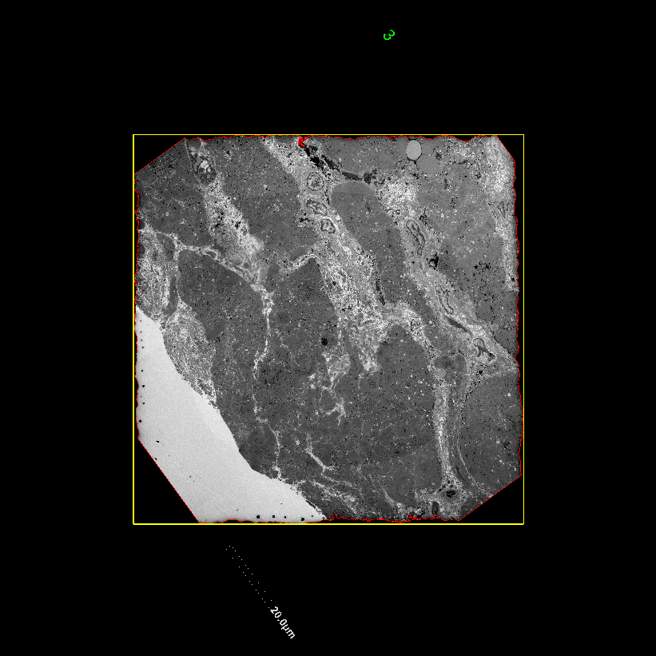</td>
      <td>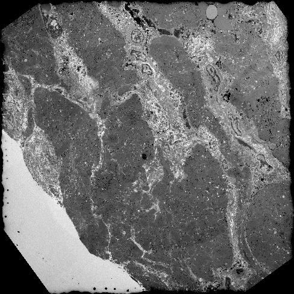</td>
      <td></td>
    </tr>
    <tr>
      <td>Original image</td>
      <td>Target region</td>
      <td>Aligned image</td>
      <td>Cropped image</td>
      <td>Mask image</td>
    </tr>
  </table>

## Patch Sampling and Labeling
Regions of interest (ROIs) were sampled and cropped using a custom GUI application, [image-patch](https://github.com/akinaka-dd/image-patch).
Each cropped patch was assigned one of nine labels (C00, C02, C04, …), including background (C18 and C19), in this example.
Spatial distribution of cropped patches overlaid on the original image, color-coded by label.

<table>
  <tr>
    <td>
    <table>
      <tr>    
        <td>C00</td>
        <td>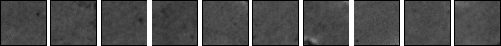</td>
      </tr>
      <tr>  
        <td>C02</td>
        <td>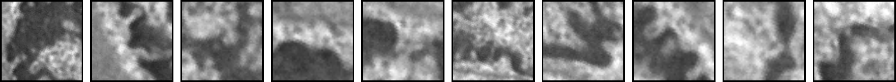</td>
      </tr>
      <tr>
        <td>C04</td>
        <td>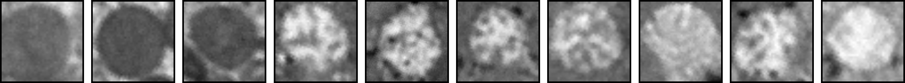</td>
      </tr>
      <tr>
        <td>C06</td>
        <td>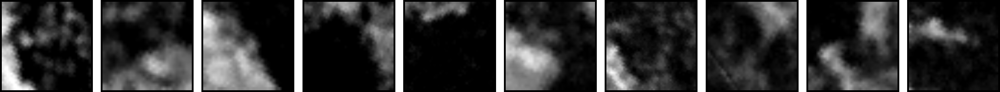</td>  
      </tr>
      <tr>
        <td>C08</td>
        <td>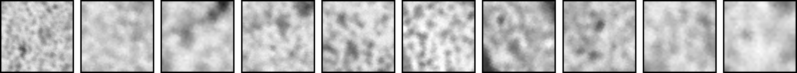</td>
      </tr>
      <tr>
        <td>C10</td>
        <td>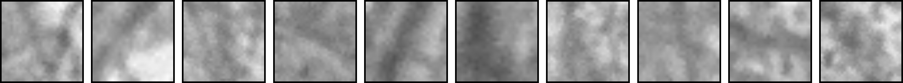</td>
      </tr>    
      <tr>
        <td>C15</td>
        <td>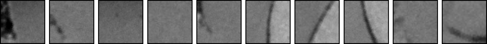</td>    
      </tr>
      <tr>
        <td>C18</td>
        <td>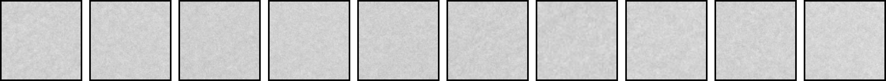</td>
      </tr>
      <tr> 
        <td>C19</td>
        <td></td>
      </tr>
    </table>
    </td>
    <td>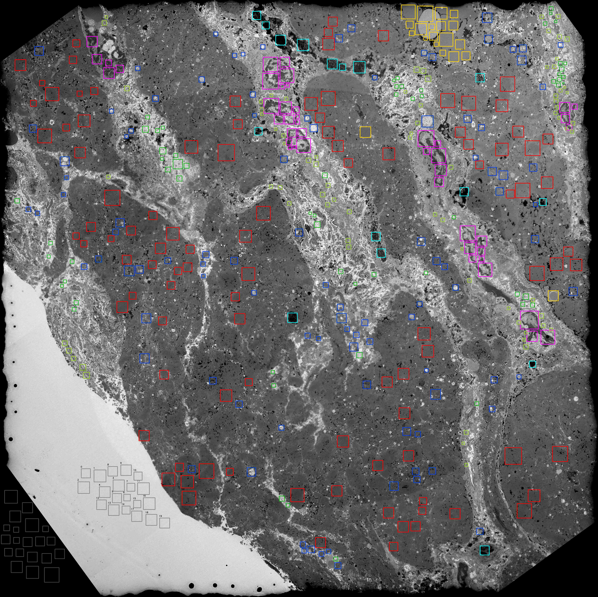</td>
  </tr>
</table>

  
## CNN Training and Evaluation
A CNN model based on a ResNet50 architecture pretrained on ImageNet was fine-tuned using the sampled patches for multi-class classification. 
The dataset was split into two subsets, with one half used for training and the other half for evaluation.
During training, data augmentation techniques such as random resized cropping and horizontal flipping were applied to improve generalization. 
Training and evaluation were repeated over multiple epochs (one full pass through the training data), 
resulting in prediction accuracy exceeding 90% on the evaluation set.

The task was formulated as a nine-class classification problem, with class probabilities computed using a softmax function, 
and the class with the highest probability was taken as the predicted label.

  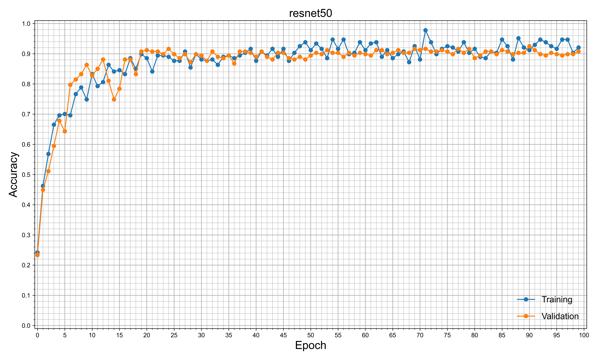

## Model Interpretation with Grad-CAM
Grad-CAM was used to visualize class-discriminative regions in the input patches. 
The method combines gradients of the target class with the feature maps from the final convolutional layer to generate a coarse localization map.
Since the last convolutional feature map has a spatial resolution of approximately $7\times7$, 
the resulting Grad-CAM map is inherently low-resolution. 
Bilinear upsampling is applied to match the input size, producing a visually smooth heatmap.
It should be noted that the upsampled visualization is only a smoothed representation of this coarse map, 
and does not reflect pixel-accurate spatial boundaries.

  <table>
    <tr>
      <td>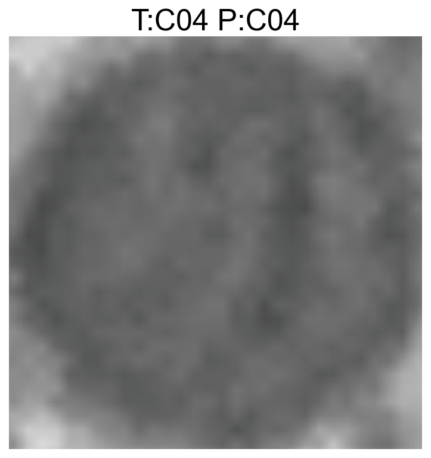</td>
<!--      <td>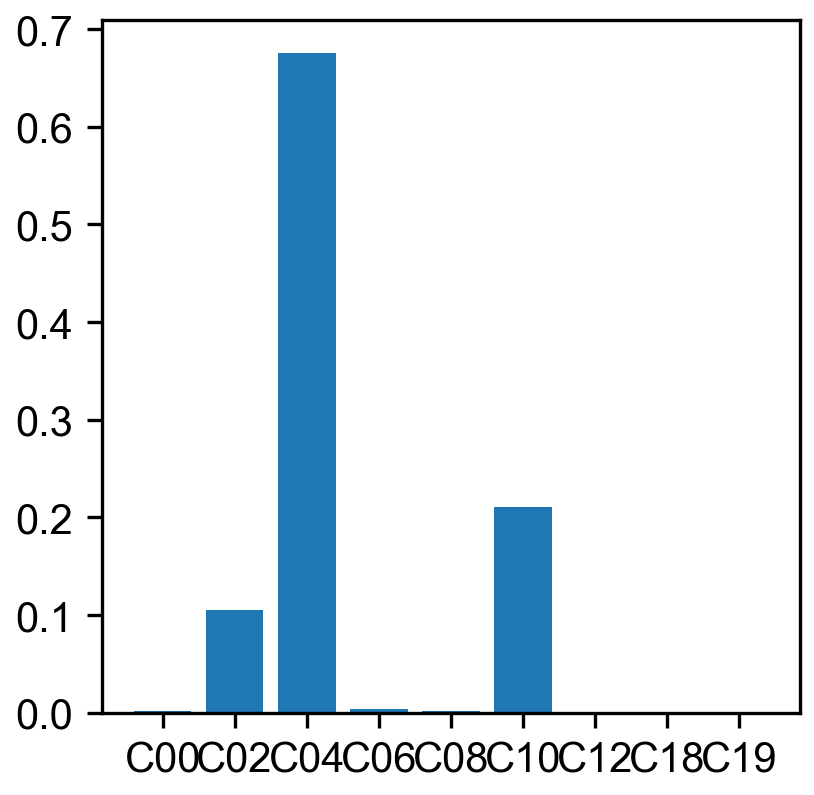</td> -->
      <td>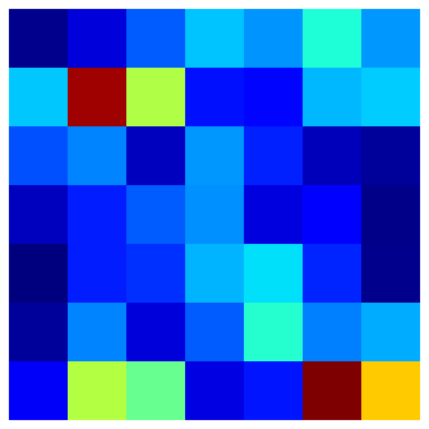</td>
      <td>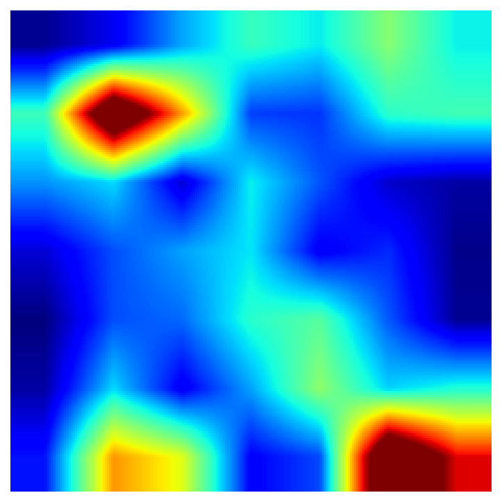</td>
<!--      <td>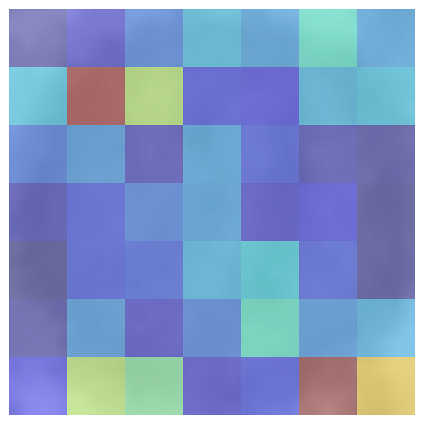</td>
      <td>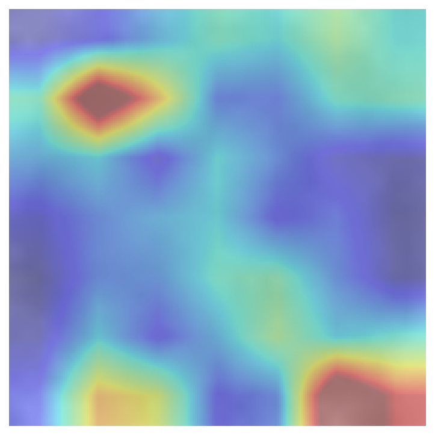</td> -->
    </tr>
    <tr>
      <td>AAAAAA AAAAAA AAAAAA</td>
<!--      <td>B</td> -->
      <td>C</td>
      <td>D</td>
<!--      <td>E</td>
      <td>F</td>    -->
    </tr>
  </table>

## WSI prediction

### TEM01-00

  <table>
    <tr>
      <td>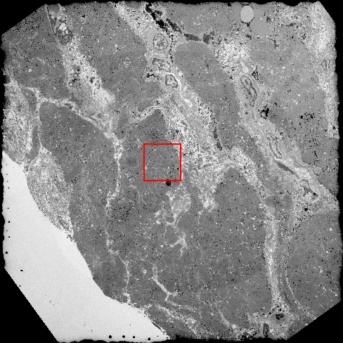</td>
      <td>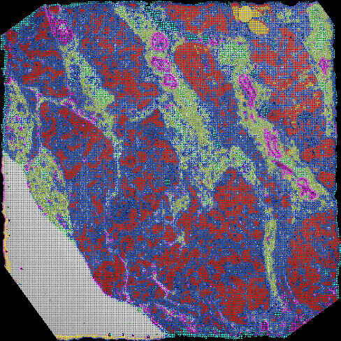</td>
      <td>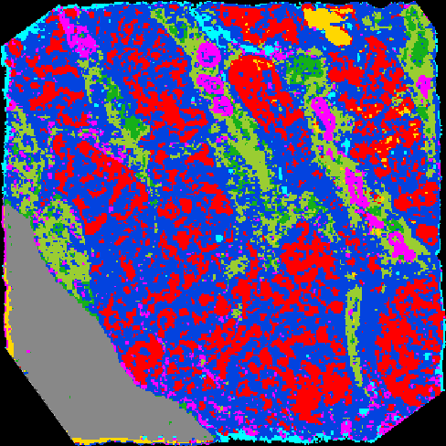</td>
      <td>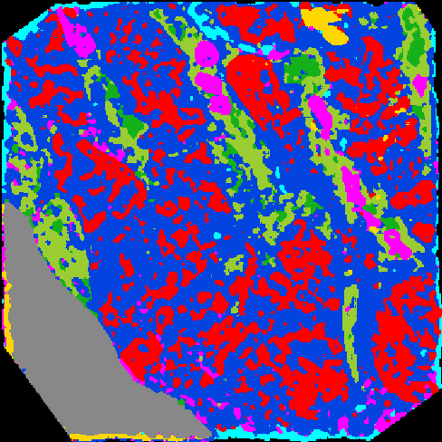</td>
      <td>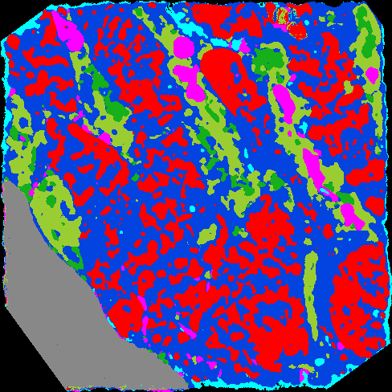</td>
    </tr>
    <tr>
      <td>Grayscale</td>
      <td>Pixel-wise</td>
      <td>Nearest neighbor  interpolation</td>
      <td>Softmax aggregation</td>
      <td>ResNet50-UNet</td>
    </tr>
  </table>

#### Zoom in

  <table>
    <tr>
      <td>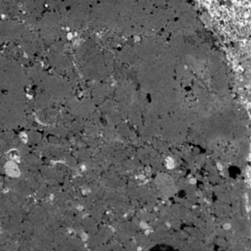</td>
      <td>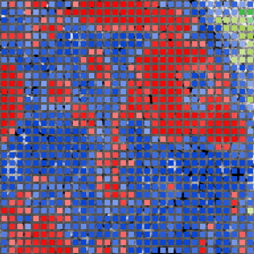</td>
      <td>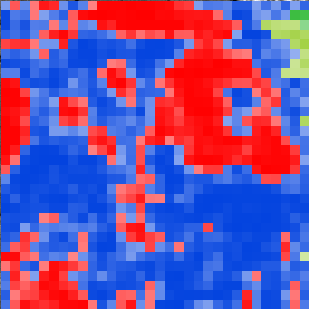</td>
      <td>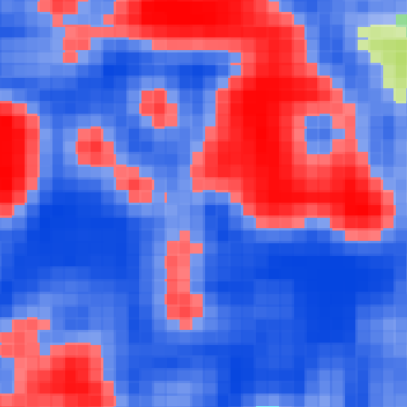</td>
      <td>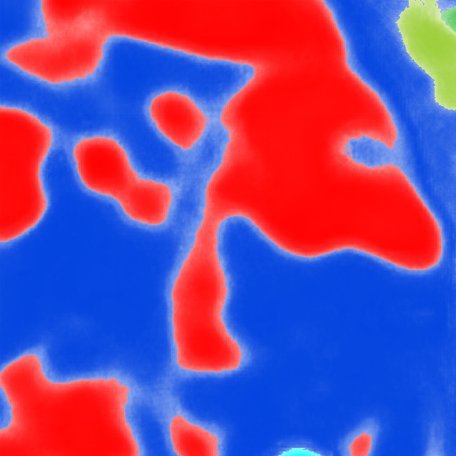</td>
    </tr>
    <tr>
      <td>Grayscale</td>
      <td>Pixel-wise</td>
      <td>Nearest neighbor  interpolation</td>
      <td>Softmax aggregation</td>
      <td>ResNet50-UNet</td>
    </tr>
  </table>

### TEM07-00

  <table>
    <tr>
      <td>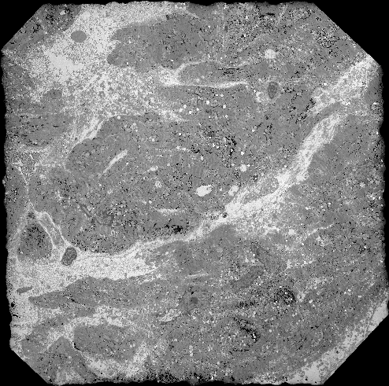</td>
      <td>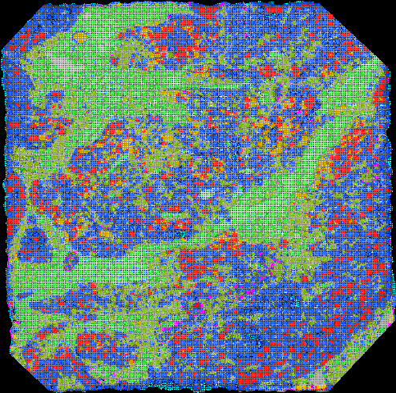</td>
      <td>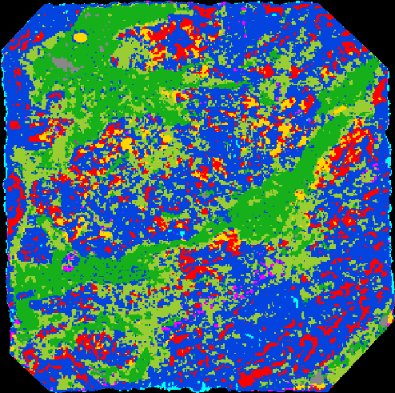</td>
      <td>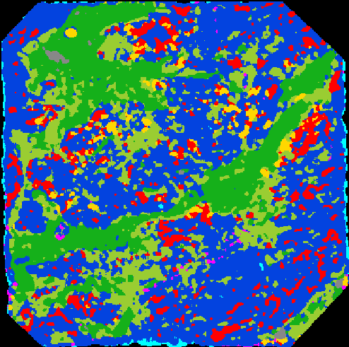</td>
      <td>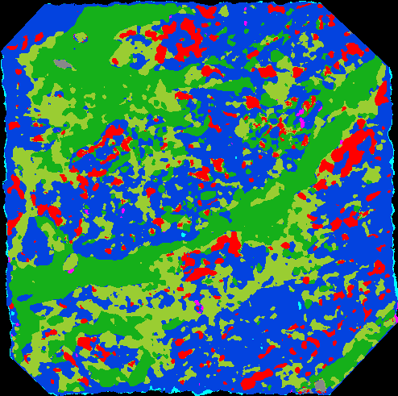</td>
    </tr>
    <tr>
      <td>Grayscale</td>
      <td>Pixel-wise</td>
      <td>Nearest neighbor  interpolation</td>
      <td>Softmax aggregation</td>
      <td>ResNet50-UNet</td>
    </tr>
  </table>

