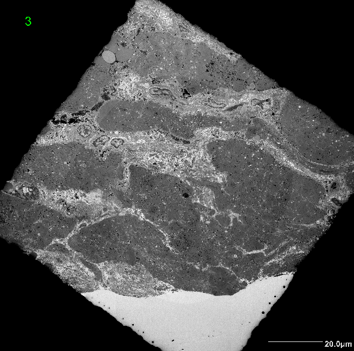
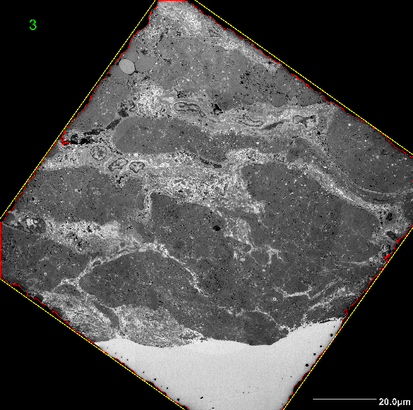

# ResNet50-UNet

## Preprocessing

  <table>
    <tr>
      <td></td>
      <td></td>
      <td></td>
      <td></td>
      <td></td>
    </tr>
    <tr>
      <td>A</td>
      <td>B</td>
      <td>C</td>
      <td>D</td>
      <td>E</td>
    </tr>
  </table>

## Sampling

## Training

  

